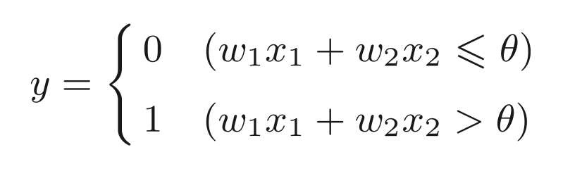
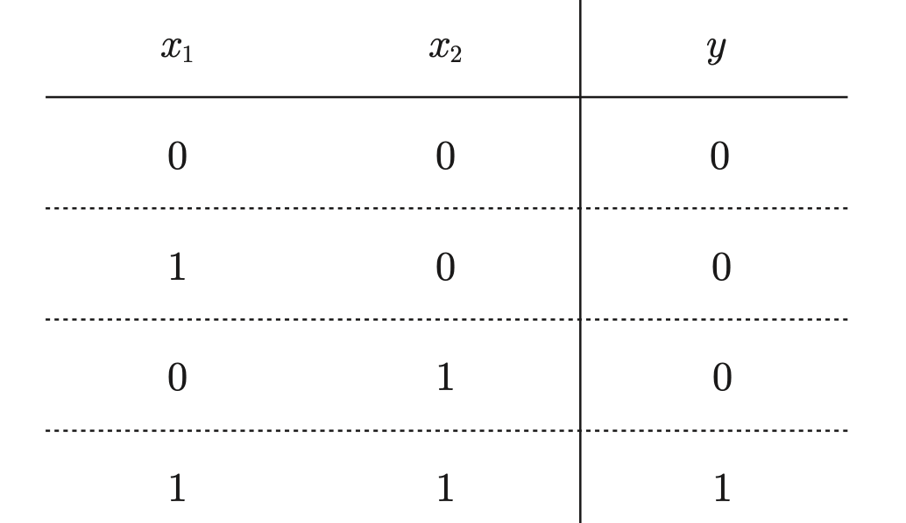
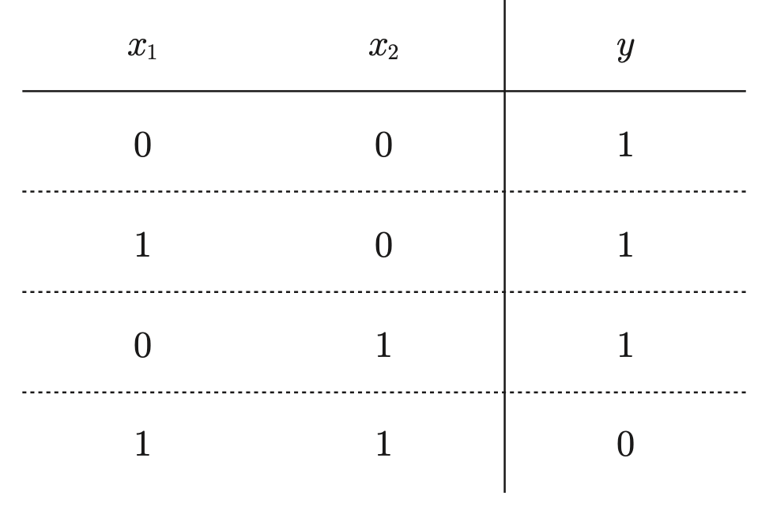
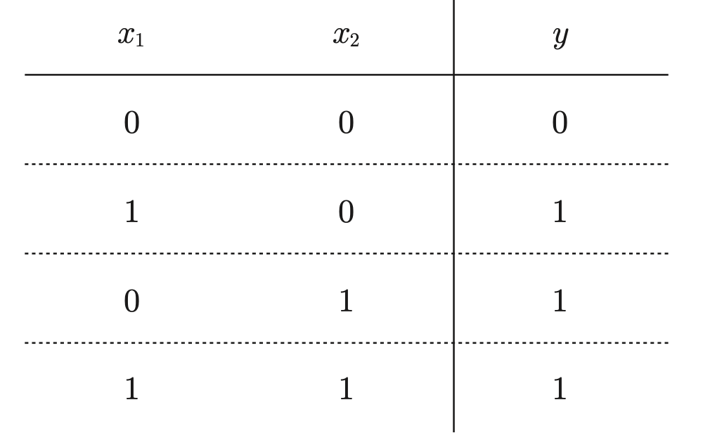
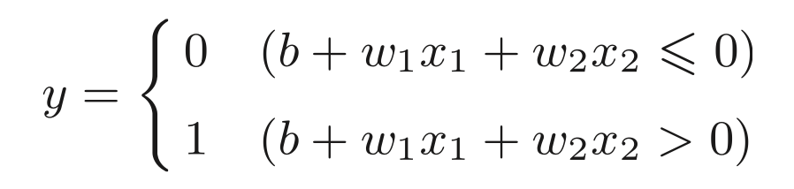
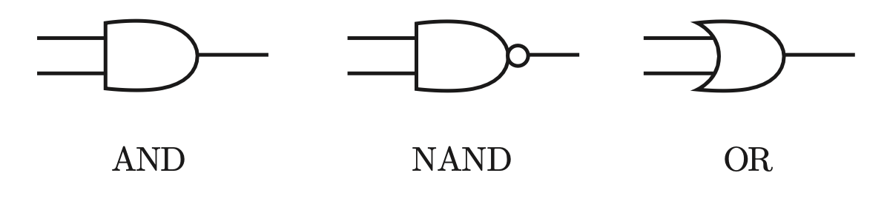
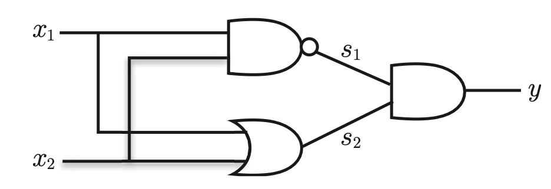
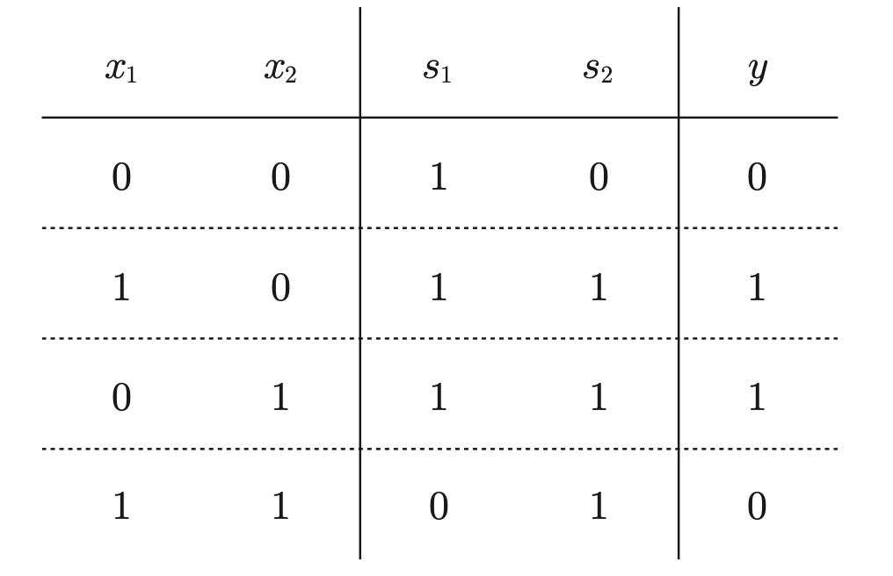
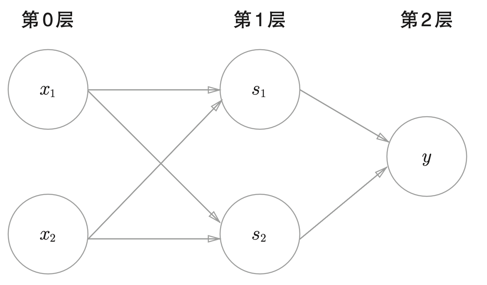

# 感知机

## 感知机原理

### 与门

### 与非门

> 颠倒了与门的输出就是与非门

**或门**

> 与门、与非门、或门的感知机构造是一样的。3 个门电路只有参数的值(权重和阈值)不同

### 偏移量

将 theta 变成 -b 表示偏移量

偏移量和权重的作用是不同的：

* 权重控制输入信号的重要程度
* 偏移量则最终定义了神经元的激活难易程度

### 异或门

可以用与门，与非门，或门三个逻辑运算组成异或门。

组成异或门

真值表

和与门、与非门、或门是单层感知机，异或门是双层感知机。叠加了多个感知机的结构也称为**多层感知机**。

> 在单层感知机无法表达的情况下，可以通过给感知机增加层数来解决问题。