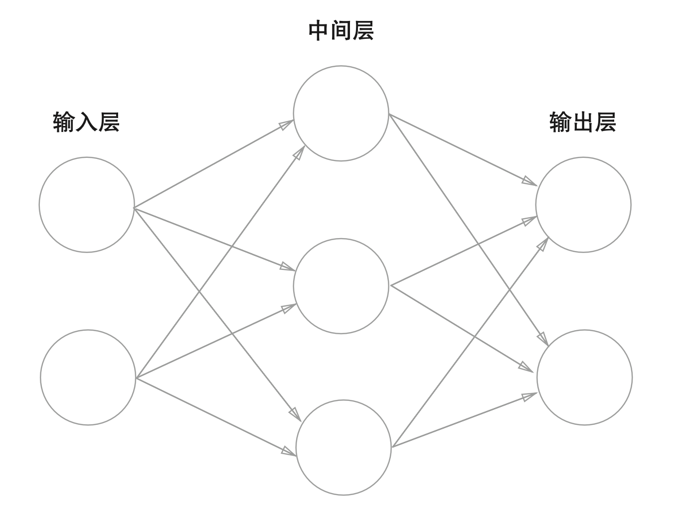
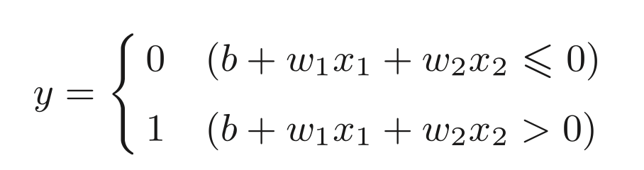
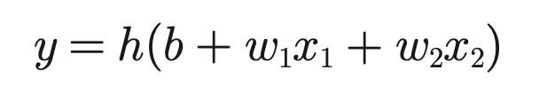
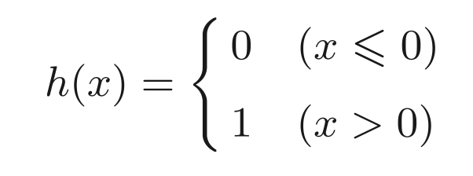
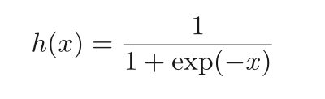

# 神经网络

神经网络也具有分层概念

中间层也称为“隐藏层”（隐藏输入细节）。

## 激活函数

原函数

用 h 函数表示后面的式子

输入信号的总和会被 h 函数进行转换，输出 y。

将输入信号的总和转换为输出信号，这种函数就称为“激活函数”。在这里 h 函数就是激活函数。

## 阶跃函数

> 阶跃函数是指一旦输入超过阈值，就切换输出的函数。

函数 h 是一个阶跃函数

一旦输出超过阈值就会切换输出。

也就是说：上面的感知机使用阶跃函数作为激活函数。

> 在众多激活函数中选择了阶跃函数来作为激活函数，如果选择了其他函数会怎么样？

## Sigmoid 函数

神经网络中最常使用的一个激活函数就是 sigmoid 函数。

$exp\left(-x \right) \ 表示\ e^{-x}$

…
