# 感知机

## 感知机原理

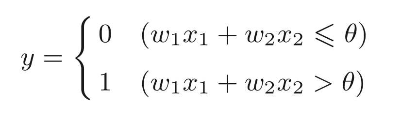

### 与门

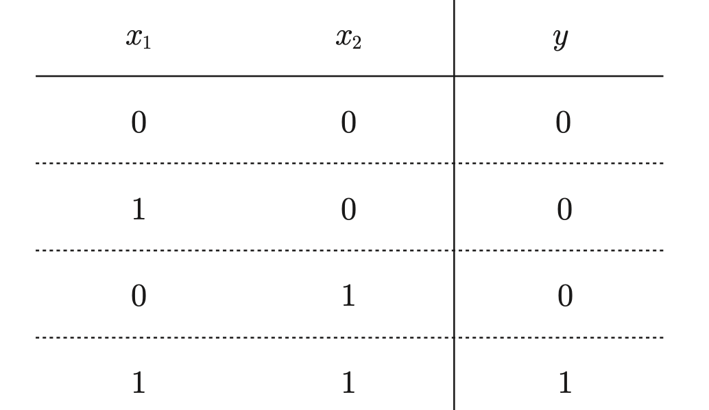

### 与非门

> 颠倒了与门的输出就是与非门

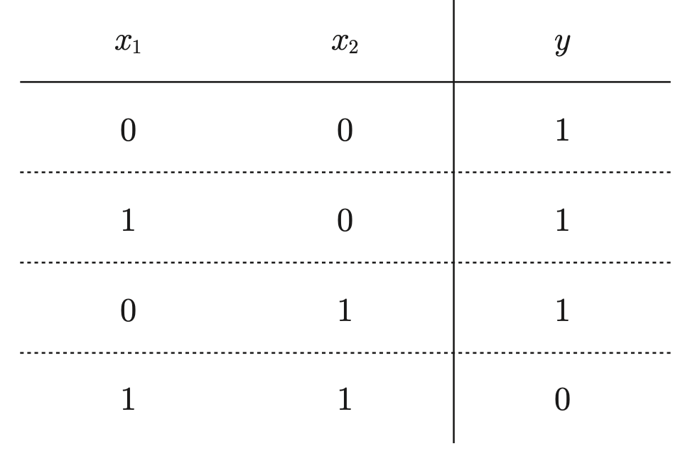

**或门**

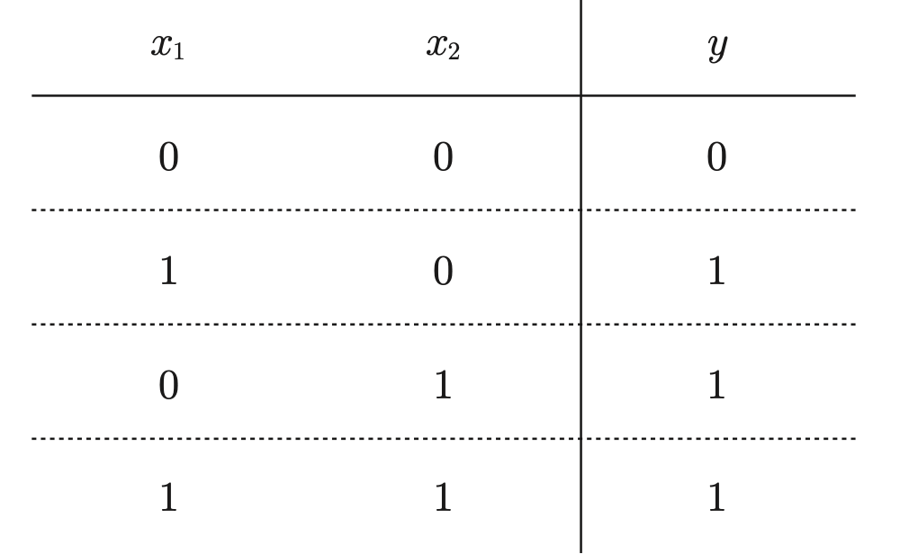

> 与门、与非门、或门的感知机构造是一样的。3 个门电路只有参数的值(权重和阈值)不同

### 偏移量

将 theta 变成 -b 表示偏移量

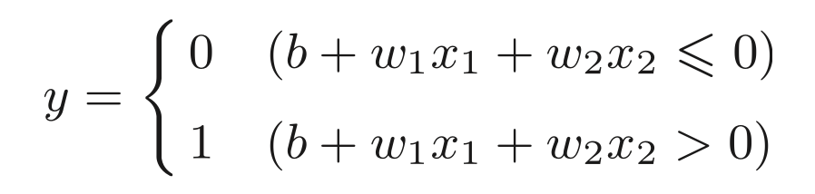

偏移量和权重的作用是不同的：

* 权重控制输入信号的重要程度
* 偏移量则最终定义了神经元的激活难易程度

### 异或门

可以用与门，与非门，或门三个逻辑运算组成异或门。

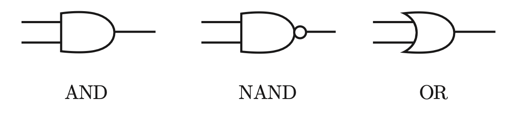

组成异或门

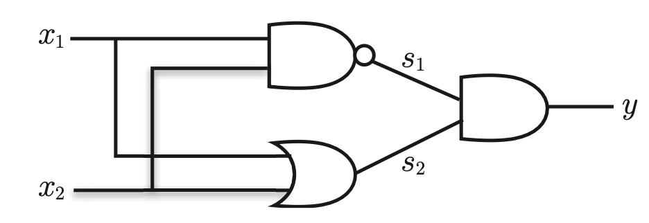

真值表

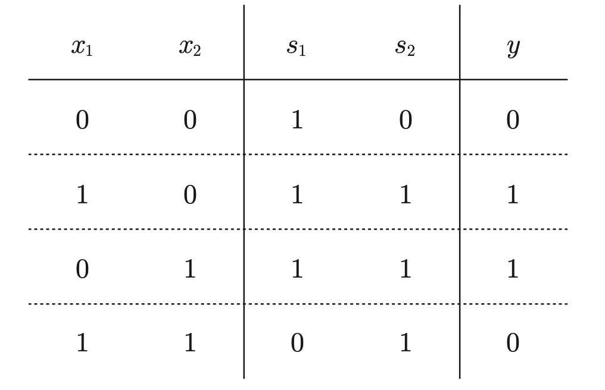

和与门、与非门、或门是单层感知机，异或门是双层感知机。叠加了多个感知机的结构也称为**多层感知机**。

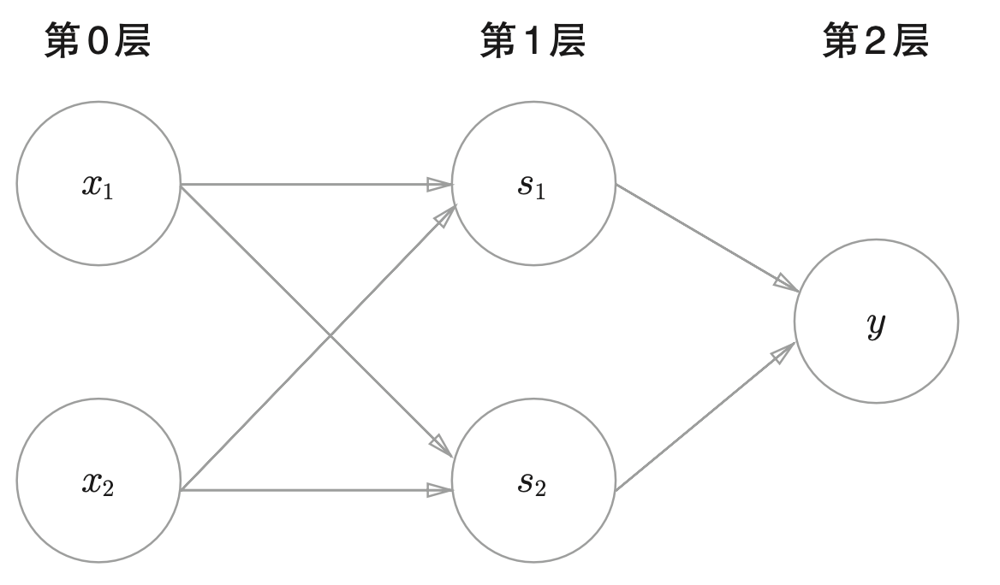

> 在单层感知机无法表达的情况下，可以通过给感知机增加层数来解决问题。

## 神经网络

神经网络也具有分层概念

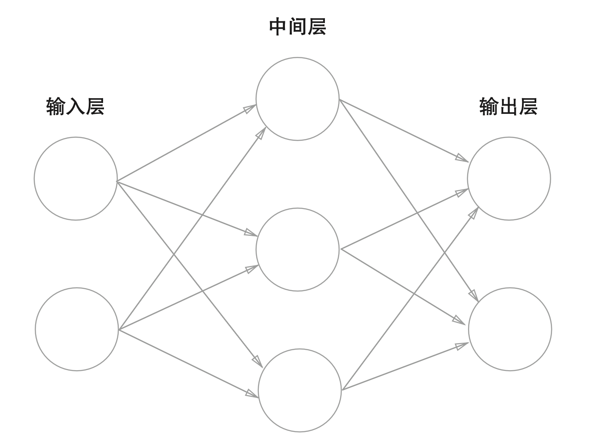

中间层也称为“隐藏层”（隐藏输入细节）。

### 激活函数

原函数

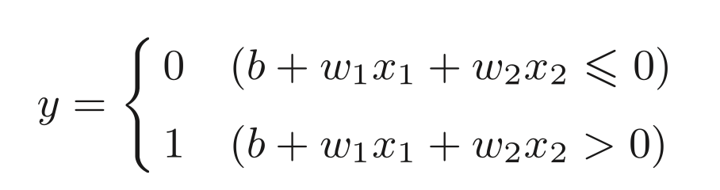

用 h 函数表示后面的式子

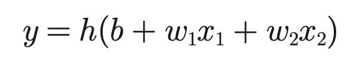

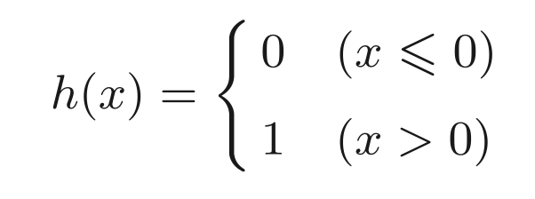

输入信号的总和会被 h 函数进行转换，输出 y。

将输入信号的总和转换为输出信号，这种函数就称为“激活函数”。在这里 h 函数就是激活函数。

### 阶跃函数

> 阶跃函数是指一旦输入超过阈值，就切换输出的函数。

函数 h 是一个阶跃函数

一旦输出超过阈值就会切换输出。

也就是说：上面的感知机使用阶跃函数作为激活函数。

> 在众多激活函数中选择了阶跃函数来作为激活函数，如果选择了其他函数会怎么样？

### Sigmoid 函数

神经网络中最常使用的一个激活函数就是 sigmoid 函数。

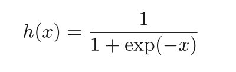

$exp\left(-x \right) \ 表示\ e^{-x}$

…
